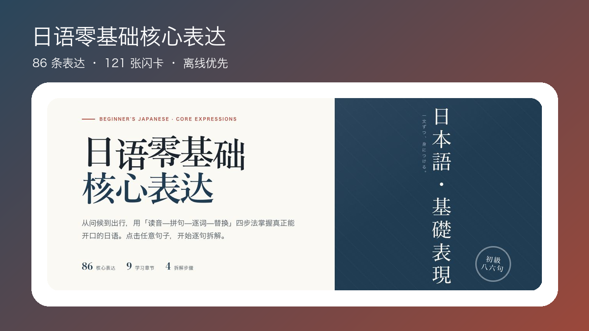
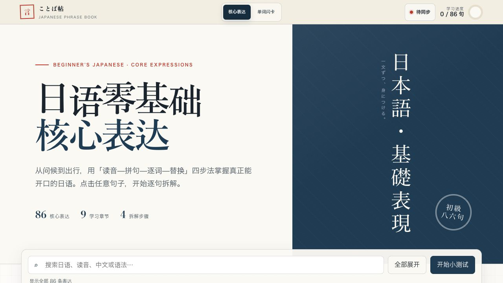
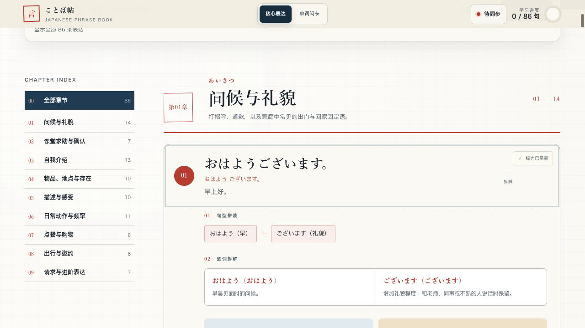

<p align="center"></p>

<h1 align="center">日语零基础核心表达</h1>
<p align="center">先学真正能开口的句子，再理解它为什么这样说。</p>

<p align="center">
  
  
  
</p>

## 学习界面

### 从今天真正会用的表达开始

首页按场景组织核心句型，读音、拼句、逐词和替换练习都在同一条学习路径里。

<p align="center"></p>

### 把一句话真正拆懂

展开表达即可查看读音、句子结构与逐词解释，不只背答案。

<p align="center"></p>

### 用闪卡巩固高频词

按类别练习 241 张词汇闪卡，从入门高频词扩展到 N3 常用动词、社会生活、学习工作、判断表达、连接副词和健康自然词汇。

<p align="center"></p>

## 学习方式

- **读音**：先建立声音印象。
- **拼句**：把表达拆成可理解的结构。
- **逐词**：看清每个词在句子里的作用。
- **替换**：替换人物、地点或动作，把一句话真正变成自己的。

课程包含 136 条核心表达、241 张单词闪卡和 14 个章节。前 86 条保留零基础学习路径，新增 50 条 N3 进阶表达，覆盖习惯与计划、推测与传闻、时间状态、条件目的及复合表达；支持搜索、小测验与离线学习。

两个学习模块使用缓存优先的页面切换：点击“核心表达”或“单词闪卡”时立即从本地缓存打开，并在后台静默更新内容。

## 使用与开发

普通使用通过部署后的 PWA 或浏览器“添加到主屏幕”，不需要在本机保留源码。开发时运行：

```bash
npm test
npm run build
```

构建结果位于 `dist/`，并可同步到 Word Notebook 的 `/japanese/` 静态目录。

```bash
npm run sync
```

默认同步到同级 `word-notebook` 仓库；其他位置可通过 `WORD_NOTEBOOK_DIR` 指定。

## 隐私

离线进度保存在浏览器本地。启用跨设备同步时，进度会发送到配套 Worker/D1；公开部署必须保持身份验证，不能暴露共享进度接口。

## License

应用源码使用 [MIT License](LICENSE)。原创课程文本与视觉内容使用 [CC BY-NC 4.0](CONTENT_LICENSE.md)。
