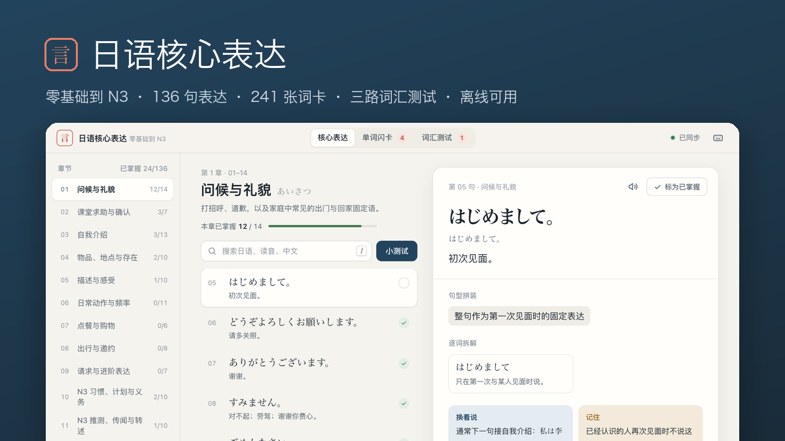
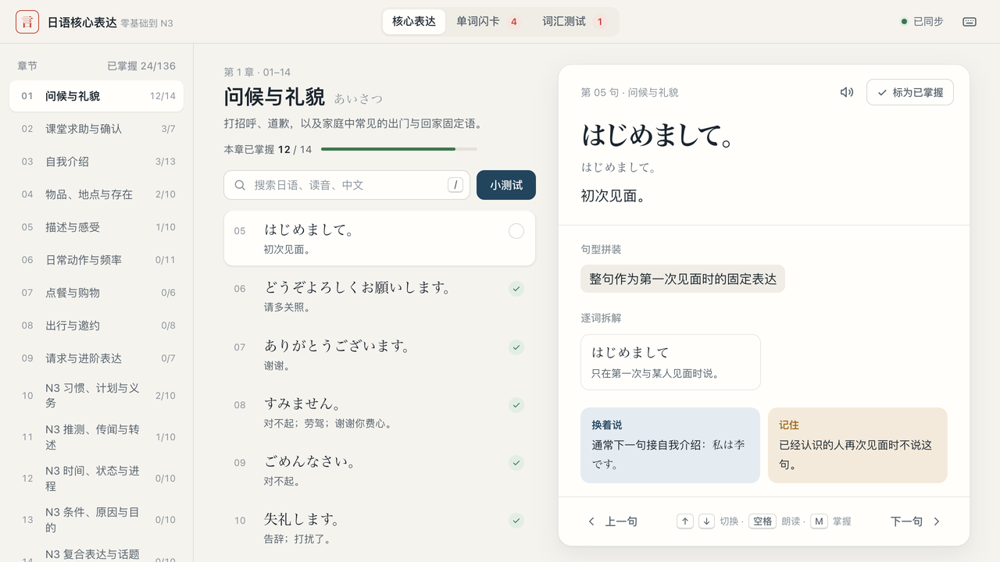
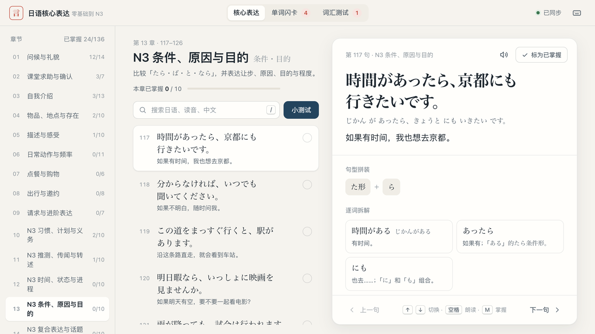
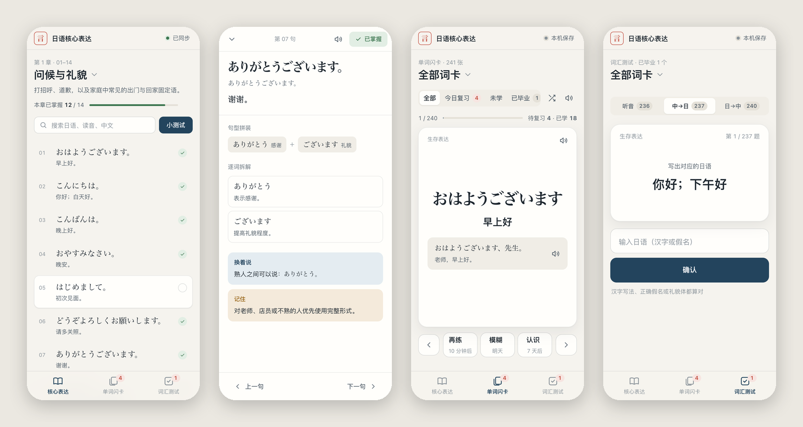

> **本仓库已归档（2026-10-04）。** 源码连同提交历史已并入 [word-notebook](https://github.com/ORDOABCHAOWT/word-notebook) 仓库的 `japanese/` 目录，后续开发、构建和部署都在那里进行。

<p align="center"></p>

<h1 align="center">日语零基础核心表达</h1>
<p align="center">先学真正能开口的句子，再理解它为什么这样说。</p>

<p align="center">
  
  
  
</p>

## 学习界面

三个模块（核心表达、背单词、词库）共用同一套界面：顶部切换模块，背单词上的角标是今天到期的词数，手机上改用底部标签栏。日文内容统一用日文明朝体，中文与界面用系统苹方，中日混排也不会串字体；跟随系统自动切换深色模式。

### 打开就回到上次学到的句子

左边是本章句子，右边是完整拆解，换句子时列表和拆解都不会跳动。方向键切换、空格朗读、M 标记掌握，打开时自动回到上次看到的那一句；全书搜索会按章节列出结果。

<p align="center"></p>

### 把一句话真正拆懂

每一句都有读音、句型拼装、逐词拆解、换着说和记忆提示；日文长句按词组断行，不会把一个词拆成两半。

<p align="center"></p>

### 背单词：每天一个入口

打开「背单词」就是今天的安排：一轮 10 个词，做完有小结，中途退出下次从原处接着做。每天学几轮由你定（1 轮约 10 个词），新词名额跟着走：1 轮 2 个、2 轮 4 个、3 轮 6 个。到期的旧词按过期时间排在前面，但不会把新词挤掉；排不下时会提示你选择今天不学新词、加一轮，或者先放着。

- **回想卡**：看提示先在心里想，再显示答案，点「忘了 / 记得 / 很熟」。按钮下面写着下次复习的时间。
- **题目方向跟着熟练度走**：刚学的词考「看日语想意思」和「听音想意思」，熟了加上「看中文想日语」；哪个方向答错过，下次先考哪个。
- **答错不清零**：退两档，本轮隔三张卡再考一次，明天再复习。
- **早就会了**：任何一张卡都能直接移出每日学习；第一次使用时可以把入门词快速筛一遍。在词库里随时能恢复。
- **专项练习**：听写和拼写日语，汉字、假名、ます形和常见说法都算对，有「不知道」和「我其实写对了」。练习只记下弱项，不改变每日安排。

间隔是 1、3、7、16、35、80、180 天；间隔到 80 天算「已掌握」。新词默认先学 N3，也可以按课程顺序。旧版闪卡和三种测试的进度会自动合并过来，取最好的一份。

### 词库

241 个词按分类列出，可以按「学习中 / 已掌握 / 未学 / 已跳过」筛选和搜索，点开能看记忆阶段、下次复习时间、忘记次数和弱项。可以批量把熟词标成「早就会了」，也可以恢复。

### 手机上同样顺手

点句子弹出全屏拆解，系统返回手势会先关闭拆解；主要按钮始终在底部标签栏上方，适配刘海屏与底部安全区。

<p align="center"></p>

## 学习方式

- **读音**：先建立声音印象。
- **拼句**：把表达拆成可理解的结构。
- **逐词**：看清每个词在句子里的作用。
- **替换**：替换人物、地点或动作，把一句话真正变成自己的。

课程包含 136 条核心表达、241 个词和 14 个章节。前 86 条保留零基础学习路径，新增 50 条 N3 进阶表达，覆盖习惯与计划、推测与传闻、时间状态、条件目的及复合表达；支持搜索、小测验与离线学习。

三个学习模块使用缓存优先的页面切换：点击“核心表达”“背单词”或“词库”时立即从本地缓存打开，并在后台静默更新内容。旧的 `/japanese/test` 地址会转到背单词。界面样式集中在 `ui/theme.css`，共用的朗读、中日混排、顶栏和访问密钥窗口在 `ui/common.js`。背单词的排期规则在 `daily-algorithm.js`（`daily-algorithm.test.js` 是它的测试），本机存储与同步在 `words-store.js`，页面在 `words-client.js`，背单词和词库两个页面由同一个模板 `背单词.html` 生成。词表在 `content/`。

## 使用与开发

普通使用通过部署后的 PWA 或浏览器“添加到主屏幕”，不需要在本机保留源码。开发时运行：

```bash
npm test
npm run build
```

构建结果位于 `dist/`，并可同步到 Word Notebook 的 `/japanese/` 静态目录。每次推送和 PR 都会由 GitHub Actions 运行同样的构建与校验。

```bash
npm run sync
```

默认同步到同级 `word-notebook` 仓库；其他位置可通过 `WORD_NOTEBOOK_DIR` 指定。

App 图标（达摩）的源文件在 `icon/`：`app-icon.svg` 用于桌面和 iOS，`app-icon-maskable.svg` 把图形收进 Android 的安全区。修改后运行 `npm run icons`，会用本机 Chrome 重新生成 `public/` 下的全部尺寸；换图标时记得同时更新页面、manifest 和 Service Worker 里图标链接的 `?v=` 版本号。图标里「言」的轮廓取自 [Zen Maru Gothic](https://github.com/googlefonts/zen-marugothic)（SIL Open Font License 1.1）。

## 隐私

进度先保存在浏览器本地，再通过配套 Worker/D1 在设备之间同步：核心表达用 `/japanese/api/progress`，背单词用 `/japanese/api/words`（每个词一条记录，按更新时间取较新的一份）。两个接口都要先登录：每台设备第一次使用时点顶栏的「未登录」，输入和 Word Notebook 相同的访问密钥。公开部署必须保持身份验证，不能暴露共享进度接口。

## License

应用源码使用 [MIT License](LICENSE)。原创课程文本与视觉内容使用 [CC BY-NC 4.0](CONTENT_LICENSE.md)。
