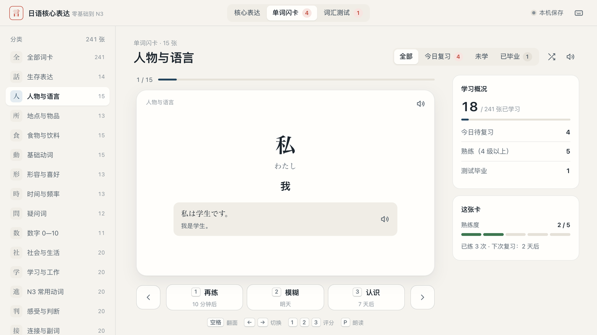
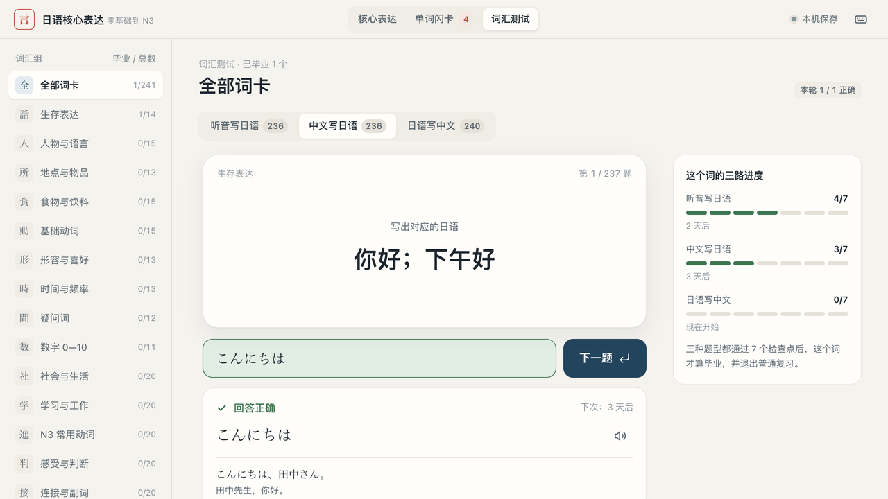

<p align="center"></p>

<h1 align="center">日语零基础核心表达</h1>
<p align="center">先学真正能开口的句子，再理解它为什么这样说。</p>

<p align="center">
  
  
  
</p>

## 学习界面

三个模块（核心表达、单词闪卡、词汇测试）共用同一套界面：顶部切换模块并显示待复习数量，左侧是章节或分类，手机上改用底部标签栏。日文内容统一用日文明朝体，中文与界面用系统苹方，中日混排也不会串字体；跟随系统自动切换深色模式。

### 打开就回到上次学到的句子

左边是本章句子，右边是完整拆解，换句子时列表和拆解都不会跳动。方向键切换、空格朗读、M 标记掌握，打开时自动回到上次看到的那一句；全书搜索会按章节列出结果。

<p align="center"></p>

### 把一句话真正拆懂

每一句都有读音、句型拼装、逐词拆解、换着说和记忆提示；日文长句按词组断行，不会把一个词拆成两半。

<p align="center"></p>

### 用闪卡巩固高频词

按类别练习 241 张词汇闪卡，从入门高频词扩展到 N3 常用动词、社会生活、学习工作、判断表达、连接副词和健康自然词汇。卡片大小固定、翻面有动画，评分按钮直接写出下次复习时间，还可以开启自动朗读。

<p align="center"></p>

### 用三路测试完成长期记忆

“词汇测试”按每一组词汇提供听音写日语、中文写日语、日语写中文三种回忆方式。每种方式独立按照 10 分钟、1 天、3 天、7 天、14 天、30 天的间隔复习；三路全部通过后词条才会毕业，并退出普通学习队列。答完就地显示标准答案、发音和例句，按 Enter 进入下一题。

<p align="center"></p>

### 手机上同样顺手

点句子弹出全屏拆解，系统返回手势会先关闭拆解；主要按钮始终在底部标签栏上方，适配刘海屏与底部安全区。

<p align="center"></p>

## 学习方式

- **读音**：先建立声音印象。
- **拼句**：把表达拆成可理解的结构。
- **逐词**：看清每个词在句子里的作用。
- **替换**：替换人物、地点或动作，把一句话真正变成自己的。

课程包含 136 条核心表达、241 张单词闪卡、三路词汇测试和 14 个章节。前 86 条保留零基础学习路径，新增 50 条 N3 进阶表达，覆盖习惯与计划、推测与传闻、时间状态、条件目的及复合表达；支持搜索、小测验与离线学习。

三个学习模块使用缓存优先的页面切换：点击“核心表达”“单词闪卡”或“词汇测试”时立即从本地缓存打开，并在后台静默更新内容。界面样式集中在 `ui/theme.css`，共用的朗读、中日混排与顶栏逻辑在 `ui/common.js`，构建时注入三个页面。

## 使用与开发

普通使用通过部署后的 PWA 或浏览器“添加到主屏幕”，不需要在本机保留源码。开发时运行：

```bash
npm test
npm run build
```

构建结果位于 `dist/`，并可同步到 Word Notebook 的 `/japanese/` 静态目录。每次推送和 PR 都会由 GitHub Actions 运行同样的构建与校验。

```bash
npm run sync
```

默认同步到同级 `word-notebook` 仓库；其他位置可通过 `WORD_NOTEBOOK_DIR` 指定。

App 图标（达摩）的源文件在 `icon/`：`app-icon.svg` 用于桌面和 iOS，`app-icon-maskable.svg` 把图形收进 Android 的安全区。修改后运行 `npm run icons`，会用本机 Chrome 重新生成 `public/` 下的全部尺寸；换图标时记得同时更新页面、manifest 和 Service Worker 里图标链接的 `?v=` 版本号。图标里「言」的轮廓取自 [Zen Maru Gothic](https://github.com/googlefonts/zen-marugothic)（SIL Open Font License 1.1）。

## 隐私

离线进度保存在浏览器本地。启用跨设备同步时，进度会发送到配套 Worker/D1；公开部署必须保持身份验证，不能暴露共享进度接口。

## License

应用源码使用 [MIT License](LICENSE)。原创课程文本与视觉内容使用 [CC BY-NC 4.0](CONTENT_LICENSE.md)。
